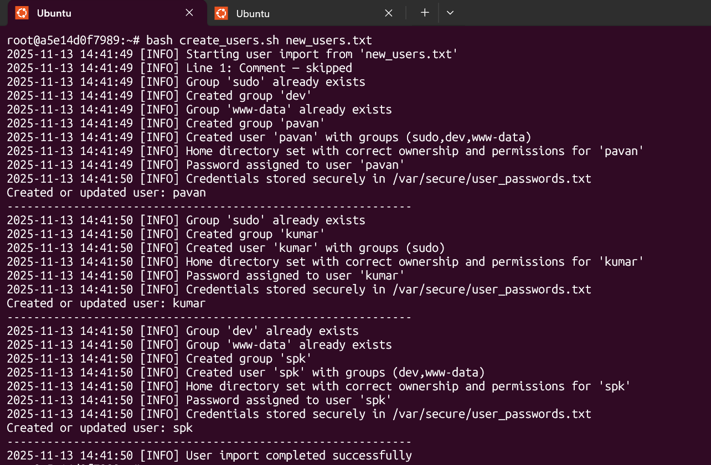
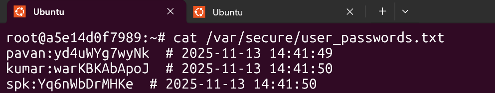
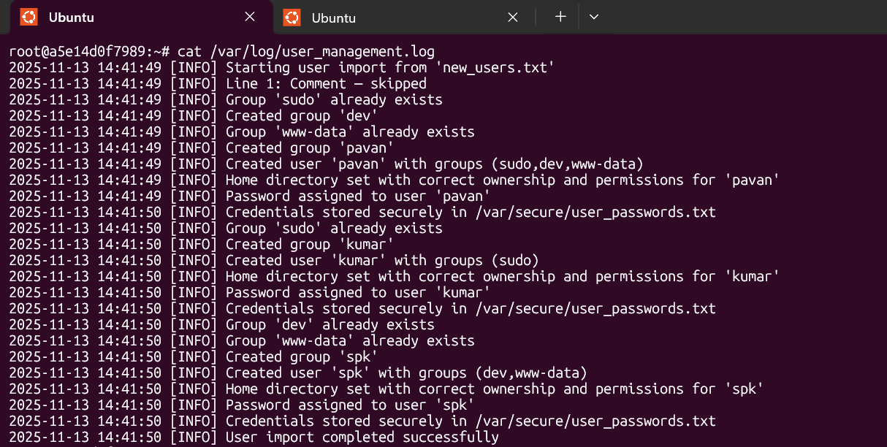
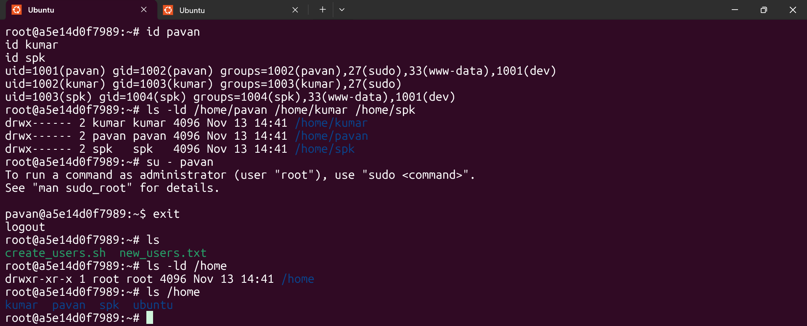

# User Management Automation (SysOps Bash Script)

A fully automated Linux user provisioning system written in Bash.  

## 1. Introduction

Managing users manually in Linux environments is repetitive and error-prone.  
This script automates the entire process to ensure consistency, security, and fast onboarding.

## Project Structure

```
User_Management_Automation/
├── create_users.sh
├── new_users.txt
└── README.md
```

## 2. Purpose and Design of the Script

### Purpose

This project reads an input file containing usernames and group memberships, then automatically:

- Creates users
- Creates required groups
- Assigns secondary groups
- Generates secure passwords
- Creates home directories
- Stores credentials
- Logs all operations

### Design Overview

1. **Input Parsing and Validation**
   - Skips comments
   - Sanitizes whitespace
   - Extracts username and groups

2. **Group Management**
   - Creates missing groups
   - Uses `getent group` to validate existence

3. **User Creation / Update**
   - Creates user with home directory if not existing
   - Updates groups if user already exists

4. **Password Assignment**
   - Generates secure random passwords
   - Stores them securely with `chmod 600`

5. **Logging**
   - Logs all operations with timestamps

6. **Clean Console Output**
   - Separation lines for readability

------------------------------------------------------------------------------------------

## 3. Requirements

- Ubuntu / Linux system or Docker Ubuntu container
- Root privileges
- Bash shell
- dos2unix (if importing files from Windows)

---------------------------------------------------------------------------------------

## 4. Input File Format

```
username; group1,group2,group3
```

Example:

```
# Developer onboarding
pavan; sudo,dev,www-data
kumar; sudo
spk; dev,www-data
```

------------------------------------------------------------------------------------

## 5. How to Run (Linux VM Method)

### Make script executable:

```bash
sudo chmod +x create_users.sh
```

### Run:

```bash
sudo ./create_users.sh new_users.txt
```

--------------------------------------------------------------------------------------

## 6. How to Run Inside WSL Using Docker

WSL cannot fully execute Linux user management.  
Use Docker Ubuntu container.

### Step 1 — Create Ubuntu container

```bash
docker run -it --name usermgmt ubuntu:24.04 bash
```
---------------------------------------------------------------------------------------------

### Step 2 — Install required packages

```bash
apt update
apt install -y sudo passwd openssl systemd-sysv vim dos2unix
```
---------------------------------------------------------------------------------------------

### Step 3 — Copy project files into container

Open another WSL terminal and run:

```bash
docker cp create_users.sh usermgmt:/root/
docker cp new_users.txt usermgmt:/root/
```
---------------------------------------------------------------------------------------------

### Step 4 — Convert Windows-format files (IMPORTANT)

Inside container:

```bash
cd /root
dos2unix create_users.sh
dos2unix new_users.txt
```

---------------------------------------------------------------------------------------------

### Step 5 — Run Script

```bash
bash create_users.sh new_users.txt
```

## 7. Console Output

Screenshot placeholder:



---------------------------------------------------------------------------------------------

## 8. Output Files Generated

### Credential File

Location:

```
/var/secure/user_passwords.txt
```

Screenshot placeholder:



---------------------------------------------------------------------------------------------

### Log File

Location:

```
/var/log/user_management.log
```

Screenshot:




---------------------------------------------------------------------------------------------

## 9. Verifying Results

```bash
cat /var/secure/user_passwords.txt
tail -n 30 /var/log/user_management.log
id pavan
id kumar
id spk
ls -ld /home/pavan /home/kumar /home/spk
```
## Confirm password works

Inside container:
Switch to a user:

su - pavan

Enter the password stored in:
```bash
/var/secure/user_passwords.txt
```

If login succeeds → password set correctly.

Screenshot:



---------------------------------------------------------------------------------------------

## 10. Security Considerations

- Passwords stored securely with chmod 600
- Home directories secured with chmod 700
- Script requires root access
- Logs kept for auditing
- Uses secure password generation

---------------------------------------------------------------------------------------------

## 11. Recommended Environments

- Docker Ubuntu container (inside WSL)
- Ubuntu Virtual Machine (VirtualBox, VMware)
- Cloud Linux VM (AWS, Azure, GCP)

---------------------------------------------------------------------------------------------

## Author
**PavanSPK**  
🔗 GitHub: [@PavanSPK](https://github.com/PavanSPK) 
